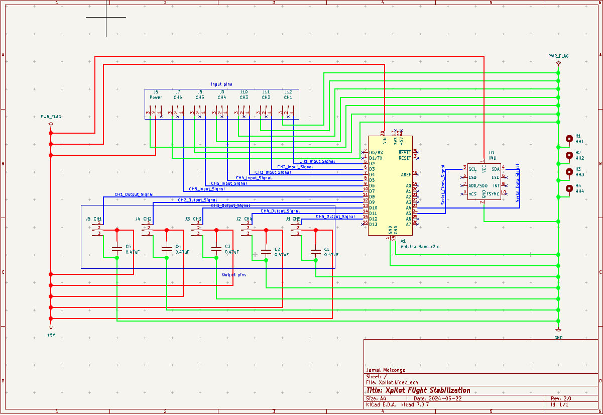

# Xpilot

Flight stabilization system intended to run on the atmega328 chip in the Arduino Nano and UNO microcontrollers.
Copyright (C) 2024 Jamal Meizongo

    This program is free software: you can redistribute it and/or modify
    it under the terms of the GNU General Public License as published by
    the Free Software Foundation, either version 3 of the License, or
    (at your option) any later version.

    This program is distributed in the hope that it will be useful,
    but WITHOUT ANY WARRANTY; without even the implied warranty of
    MERCHANTABILITY or FITNESS FOR A PARTICULAR PURPOSE.  See the
    GNU General Public License for more details.

    THE SOFTWARE IS PROVIDED "AS IS", WITHOUT WARRANTY OF ANY KIND, EXPRESS OR
    IMPLIED, INCLUDING BUT NOT LIMITED TO THE WARRANTIES OF MERCHANTABILITY,
    FITNESS FOR A PARTICULAR PURPOSE AND NONINFRINGEMENT. IN NO EVENT SHALL THE
    AUTHORS OR COPYRIGHT HOLDERS BE LIABLE FOR ANY CLAIM, DAMAGES OR OTHER
    LIABILITY, WHETHER IN AN ACTION OF CONTRACT, TORT OR OTHERWISE, ARISING FROM,
    OUT OF OR IN CONNECTION WITH THE SOFTWARE OR THE USE OR OTHER DEALINGS IN
    THE SOFTWARE.

    You should have received a copy of the GNU General Public License
    along with this program.  If not, see <https://www.gnu.org/licenses/>.

### Developed using PlatformIO on vscode

### Servos need to be installed correctly for this to work.

Designed with a 3-channel system(AIL, ELEV, RUDD) in mind; some modifications are necessary to convert it for a 2-channel system.
The atmega328p chip in the arduino nano is fast enough to run the entire stabilization loop in 4ms.
This gives us a frequency of ~250Hz. Output to the control servos are updated at 50Hz for standard servos.

The frequency refers to the rate at which the software is updating or making corrections.

In the context of RC planes, an execution loop of 250Hz provides a smooth and responsive control, which is particularly beneficial for maintaining stability in changing flight conditions.

## Setup

Connect GY-91/MPU9250 to Arduino Nano as shown below

| PIN | VALUE |
| :-: | :---: |
| VIN |  5v   |
| GND |  GND  |
| SCL |  A5   |
| SDA |  A4   |

Connect receiver to Arduino Nano as shown below

| CHANNEL  | PIN |
| :------: | :-: |
| Aileron  |  2  |
| Elevator |  3  |
|  Rudder  |  4  |
|   Mode   |  5  |

Connect aileron, elevator and rudder servos to Arduino Nano as shown below. DO NOT power the servos using the 5v power output from the Arduino Nano as this might harm the microcontroller.
However, the Nano, GY-91/MPU9250 and servos can be powered from one 5VDC power source. It is also a good idea to make use of 0.47uF decoupling capacitors close to the individual servos for a stable power supply.

| CHANNEL  | PIN |
| :------: | :-: |
| Aileron  |  9  |
| Elevator | 10  |
|  Rudder  | 11  |

These pin numbers with the exception of GY-91/MPU9250 can be reconfigured in [config.h](lib/Xpilot/src/config.h).
Ensure all components share a common ground. The Nano and GY-91/MPU9250 do not require decoupling capacitors as the breakout boards come with their own decoupling capacitors.

## Flight modes

There are 3 flight modes; modes 1 = manual/passthrough, 2 = fly-by-wire, and 3 - stabilize.

|      Flight mode       |                                     Description                                     |
| :--------------------: | :---------------------------------------------------------------------------------: |
| Manual/Passthrough - 1 |                 Manual flight control surface movement, passthrough                 |
|        Rate - 2        |                          Gyro based rate of change control                          |
|     Stabilize - 3      | Surfaces follow stick movement up-to set limits with wing-leveling on stick release |

Rate mode is the most popular among inexperienced flyers. Manual/Passthrough is the default mode of operation if mode switch has not been configured.
Note that there is currently no aileron and rudder mixing available to coordinate turns. This will be fixed in an upcoming update.

Pull requests are welcome. Please try to adhere to the coding style in the project. I will review and approve them as time and opportunity permits.

## Setup

Be sure to go through [config.h](lib/Xpilot/src/config.h) and perform preflight checks and modifications before flight.

## Credits

hideakitai - [MPU9250 library](https://github.com/hideakitai/MPU9250)
NicoHood - [PinChangeInterrupt library](https://github.com/NicoHood/PinChangeInterrupt)
