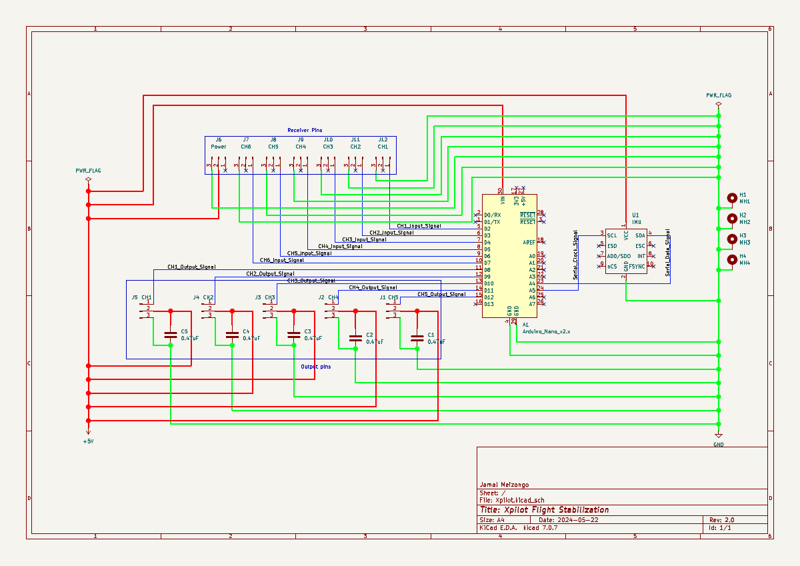

  

# Xpilot

Flight stabilization system intended to run on the atmega328 chip in the Arduino Nano and UNO microcontrollers.
Copyright (C) 2024 Jamal Meizongo

    This program is free software: you can redistribute it and/or modify
    it under the terms of the GNU General Public License as published by
    the Free Software Foundation, either version 3 of the License, or
    (at your option) any later version.

    This program is distributed in the hope that it will be useful,
    but WITHOUT ANY WARRANTY; without even the implied warranty of
    MERCHANTABILITY or FITNESS FOR A PARTICULAR PURPOSE.  See the
    GNU General Public License for more details.

    THE SOFTWARE IS PROVIDED "AS IS", WITHOUT WARRANTY OF ANY KIND, EXPRESS OR
    IMPLIED, INCLUDING BUT NOT LIMITED TO THE WARRANTIES OF MERCHANTABILITY,
    FITNESS FOR A PARTICULAR PURPOSE AND NONINFRINGEMENT. IN NO EVENT SHALL THE
    AUTHORS OR COPYRIGHT HOLDERS BE LIABLE FOR ANY CLAIM, DAMAGES OR OTHER
    LIABILITY, WHETHER IN AN ACTION OF CONTRACT, TORT OR OTHERWISE, ARISING FROM,
    OUT OF OR IN CONNECTION WITH THE SOFTWARE OR THE USE OR OTHER DEALINGS IN
    THE SOFTWARE.

    You should have received a copy of the GNU General Public License
    along with this program.  If not, see <https://www.gnu.org/licenses/>.

### Developed using PlatformIO on vscode

Xpilot is a flight stabilization system based on the ATMEGA328P chip in the Arduino Nano, Uno and Mini microcontrollers and MPU6050.  

It is capable of stabilizing various airplane types including the traditional airplane, V-tail, flying wings(with and without rudder) and 2-channel planes.

See [XP_SERIAL.md](XP_SERIAL.md) for information on using the serial interface to set flight configurations.

## Stabilization system loop

The main loop and IMU runs at 250Hz.
This is sufficient for the flight characteristics of the UAV this software was designed for(i.e. slow-to-mild acrobatic).

## Setup
### Input

|                                            CHANNEL                                            | PIN |
| :-------------------------------------------------------------------------------------------: | :-: |
|                                            Aileron                                            |  2  |
|                                           Elevator                                            |  3  |
|                                            Rudder                                             |  4  |
|                                          AUX1 - Mode                                          |  5  |
|   FLAPERON (if activated in [SystemConfig.h](lib/SystemConfig/src/SystemConfig.h))            |  6  |
| AUX3 - User defined (if activated in [SystemConfig.h](lib/SystemConfig/src/SystemConfig.h))   |  7  |

### Output

|  CHANNEL  | PIN |
| :-------: | :-: |
| Aileron1  |  8  |
| Aileron2  |  9  |
| Elevator  | 10  |
|  Rudder   | 11  |
| Auxiliary | 12  |

### Mode switch

| AUX Switch Position |    Mode     |
| :-----------------: | :---------: |
|          0          | Passthrough |
|          1          |    Rate     |
|          2          |  Stabilize  |

## Info

These pin numbers with the exception of MPU6050 can be reconfigured in [GPIOConfig.h](lib/SystemConfig/src/GPIODef.h). However, changing the pins for the channel inputs to Xpilot will require modifications to the PinChangeInterrupt library.

  

## Flight modes

There are 3 flight modes; 1 = passthrough/manual, 2 = rate, and 3 = stabilize.

Rate mode is the most popular among inexperienced flyers. If mode switch is not configured, rate mode is the default.  

Passthrough mode is for advanced flyers. It passes the output through a slew rate limiter before the servos receive the command. The slew rate is configurable.

Rudder mixing for coordinated turns is enabled automatically in rate and stabilize modes and off by default in passthrough mode. Default aileron-to-rudder mixing value is 30%.

|      Flight mode       |                                     Description                                     |
| :--------------------: | :---------------------------------------------------------------------------------: |
| Manual/Passthrough - 1 |                 Manual flight control surface movement, passthrough                 |
|        Rate - 2        |                               Gyro based rate control                               |
|     Stabilize - 3      | Surfaces follow stick movement up-to set limits with wing-leveling on stick release |

## NOTICE

Throttle is always under manual control.

Rate/Expo set up on the transmitter should NOT be used for Rate(2)/Stabilize(3) flight modes. You can however configure Rate/Expo for passthrough(1) flight mode.

The IMU is calibrated through xp_serial.py.

## Build & Upload

To build and upload the project to the microcontroller, download [vscode](https://code.visualstudio.com/download) if you don't already have it and install the PlatformIO extension. With the project folder open in vscode, run the _platformio.exe run --target upload_ command in the terminal or click on the _PlatformIO:Upload button_ in the bottom status bar.

## Preflight

Be sure to go through [XP_SERIAL.md](XP_SERIAL.md) and perform any required modifications and preflight checks before flight.

Pull requests are welcome. Please try to adhere to the coding style in the project. I will review and approve them as time and opportunity permits.

## Donate

If you like this project and want to support me create more open source projects like this, please consider donating to my PayPal.  

## Disclaimer:

Do not expect this software to out perform other more established flight controller projects such as ArduPilot, inav, betaFlight etc. This code shall be considered as highly experimental and is not designed or written to any safety critical, or mission critical standards. It is given/shared for free with the knowledge and understanding that this open source flight stabilization software is only for small hobby based electrically powered model aircraft, or other small hobby radio controlled vehicles. It is intended to be used or modified to suit your needs for small models and is NOT to be used on any manned vehicles. The author(s) shall not be held responsible or accountable for any damage, injury or loss that may be inflicted or incurred as a result of the use or misuse of this code. Use and modify at your own risk and use within accordance of your country's laws and/or regulations.

By using this, or any part of this software you agree to [this license agreement.](https://github.com/mrmeizongo/Xpilot/blob/main/LICENSE)

## Credits

NicoHood - [PinChangeInterrupt library](https://github.com/NicoHood/PinChangeInterrupt)
